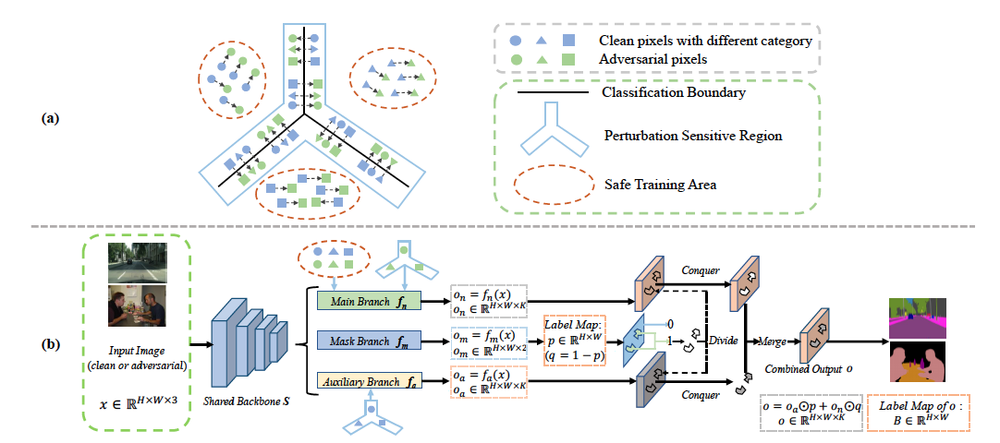
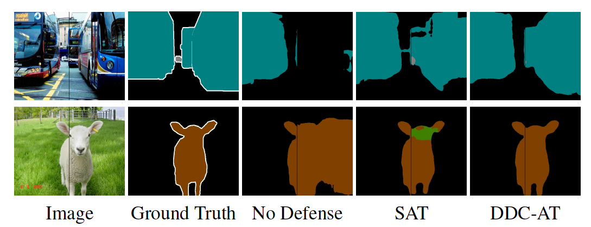

# Dynamic Divide-and-Conquer Adversarial Training for Robust Semantic Segmentation

This is a pytorch project for the paper **Dynamic Divide-and-Conquer Adversarial Training for Robust Semantic Segmentation** by Xiaogang Xu, Hengshuang Zhao and Jiaya Jia presented at **ICCV2021**.

[paper link](https://jiaya.me/publication/), [arxiv](https://arxiv.org/pdf/2003.06555)

## Introduction
Adversarial training is promising for improving the robustness of deep neural networks towards adversarial perturbations, especially on the classification task. The effect of this type of training on semantic segmentation, contrarily, just commences.
We make the initial attempt to explore the defense strategy on semantic segmentation by formulating a general adversarial training procedure that can perform decently on both adversarial and clean samples.
We propose a dynamic divide-and-conquer adversarial training (DDC-AT) strategy to enhance the defense effect, by setting additional branches in the target model during training, and dealing with pixels with diverse properties towards adversarial perturbation.
Our dynamical division mechanism divides pixels into multiple branches automatically. Note all these additional branches can be abandoned during inference and thus leave no extra parameter and computation cost.
Extensive experiments with various segmentation models are conducted on PASCAL VOC 2012 and Cityscapes datasets, in which DDC-AT yields satisfying performance under both white- and black-box attacks.







## Project Setup
For multiprocessing training, we use [apex](https://github.com/NVIDIA/apex), tested with pytorch 1.0.1.

First install Python 3. We advise you to install Python 3 and PyTorch with Anaconda:

```
conda create --name py36 python=3.6
source activate py36
```

Clone the repo and install the complementary requirements:
```
cd $HOME
git clone --recursive git@github.com:dvlab-research/Robust_Semantic_Segmentation.git
cd Robust_Semantic_Segmentation
pip install -r requirements.txt
```

The environment of our experiments is CUDA10.2 and TITAN V. And you should install apex for training.

## Requirement

- Hardware: 4-8 GPUs (better with >=11G GPU memory)

## Train

- Download related datasets and you should modify the relevant paths specified in folder "config"
- Download ImageNet pre-trained [models]((https://drive.google.com/open?id=15wx9vOM0euyizq-M1uINgN0_wjVRf9J3)) and put them under folder `initmodel` for weight initialization.

### Cityscapes
- Train the baseline model with no defense on Cityscapes with PSPNet
  ```
  sh tool_train/cityscapes/psp_train.sh
  ```
- Train the baseline model with no defense on Cityscapes with DeepLabv3
  ```
  sh tool_train/cityscapes/aspp_train.sh
  ```
- Train the model with SAT on Cityscapes with PSPNet
  ```
  sh tool_train/cityscapes/psp_train_sat.sh
  ```
- Train the model with SAT on Cityscapes with DeepLabv3
  ```
  sh tool_train/cityscapes/aspp_train_sat.sh
  ```
- Train the model with DDCAT on Cityscapes with PSPNet
  ```
  sh tool_train/cityscapes/psp_train_ddcat.sh
  ```
- Train the model with DDCAT on Cityscapes with DeepLabv3
  ```
  sh tool_train/cityscapes/aspp_train_ddcat.sh
  ```

### VOC2012
- Train the baseline model with no defense on VOC2012 with PSPNet
  ```
  sh tool_train/voc2012/psp_train.sh
  ```
- Train the baseline model with no defense on VOC2012 with DeepLabv3
  ```
  sh tool_train/voc2012/aspp_train.sh
  ```
- Train the model with SAT on VOC2012 with PSPNet
  ```
  sh tool_train/voc2012/psp_train_sat.sh
  ```
- Train the model with SAT on VOC2012 with DeepLabv3
  ```
  sh tool_train/voc2012/aspp_train_sat.sh
  ```
- Train the model with DDCAT on VOC2012 with PSPNet
  ```
  sh tool_train/voc2012/psp_train_ddcat.sh
  ```
- Train the model with DDCAT on VOC2012 with DeepLabv3
  ```
  sh tool_train/voc2012/aspp_train_ddcat.sh
  ```

You can use the tensorboardX to visualize the training loss, by
```
tensorboard --logdir=exp/path_to_log
```


## Test

We provide the script for evaluation, reporting the miou on both clean and adversarial samples
(the adversarial samples are obtained with attack whose n=2, epsilon=0.03 x 255, alpha=0.01 x 255)

### Cityscapes
- Evaluate the PSPNet trained with no defense on Cityscapes
  ```
  sh tool_test/cityscapes/psp_test.sh
  ```
- Evaluate the PSPNet trained with SAT on Cityscapes
  ```
  sh tool_test/cityscapes/psp_test_sat.sh
  ```
- Evaluate the PSPNet trained with DDCAT on Cityscapes
  ```
  sh tool_test/cityscapes/psp_test_ddcat.sh
  ```
- Evaluate the DeepLabv3 trained with no defense on Cityscapes
  ```
  sh tool_test/cityscapes/aspp_test.sh
  ```
- Evaluate the DeepLabv3 trained with SAT on Cityscapes
  ```
  sh tool_test/cityscapes/aspp_test_sat.sh
  ```
- Evaluate the DeepLabv3 trained with DDCAT on Cityscapes
  ```
  sh tool_test/cityscapes/aspp_test_ddcat.sh
  ```


### VOC2012
- Evaluate the PSPNet trained with no defense on VOC2012
  ```
  sh tool_test/voc2012/psp_test.sh
  ```
- Evaluate the PSPNet trained with SAT on VOC2012
  ```
  sh tool_test/voc2012/psp_test_sat.sh
  ```
- Evaluate the PSPNet trained with DDCAT on VOC2012
  ```
  sh tool_test/voc2012/psp_test_ddcat.sh
  ```
- Evaluate the DeepLabv3 trained with no defense on VOC2012
  ```
  sh tool_test/voc2012/aspp_test.sh
  ```
- Evaluate the DeepLabv3 trained with SAT on VOC2012
  ```
  sh tool_test/voc2012/aspp_test_sat.sh
  ```
- Evaluate the DeepLabv3 trained with DDCAT on VOC2012
  ```
  sh tool_test/voc2012/aspp_test_ddcat.sh
  ```


## Pretrained Model

You can download the pretrained models from https://drive.google.com/file/d/120xLY_pGZlm3tqaLxTLVp99e06muBjJC/view?usp=sharing

### Cityscapes with PSPNet
The model trained with no defense: pretrain/cityscapes/pspnet/no_defense  
The model trained with SAT: pretrain/cityscapes/pspnet/sat  
The model trained with DDCAT: pretrain/cityscapes/pspnet/ddcat

### Cityscapes with DeepLabv3
The model trained with no defense: pretrain/cityscapes/deeplabv3/no_defense  
The model trained with SAT: pretrain/cityscapes/deeplabv3/sat  
The model trained with DDCAT: pretrain/cityscapes/deeplabv3/ddcat

### VOC2012 with PSPNet
The model trained with no defense: pretrain/voc2012/pspnet/no_defense  
The model trained with SAT: pretrain/voc2012/pspnet/sat  
The model trained with DDCAT: pretrain/voc2012/pspnet/ddcat

### VOC2012 with DeepLabv3
The model trained with no defense: pretrain/voc2012/deeplabv3/no_defense  
The model trained with SAT: pretrain/voc2012/deeplabv3/sat  
The model trained with DDCAT: pretrain/voc2012/deeplabv3/ddcat


## Citation Information

If you find the project useful, please cite:

```
@inproceedings{xu2021ddcat,
  title={Dynamic Divide-and-Conquer Adversarial Training for Robust Semantic Segmentation},
  author={Xiaogang Xu, Hengshuang Zhao and Jiaya Jia},
  booktitle={ICCV},
  year={2021}
}
```


## Acknowledgments
This source code is inspired by [semseg](https://github.com/hszhao/semseg).

## Contributions
If you have any questions/comments/bug reports, feel free to e-mail the author Xiaogang Xu ([xgxu@cse.cuhk.edu.hk](xgxu@cse.cuhk.edu.hk)).

